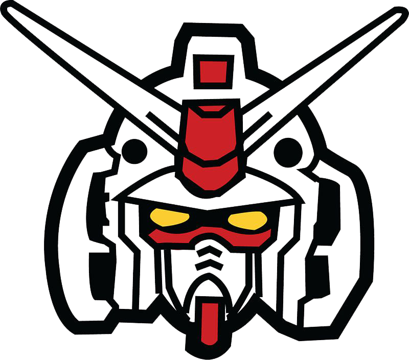

## Project GUNDAM-X
An e-commerce and product management application for Gundam models using ReactJS and PHP Laravel.

GUNDAM-X is a website that offers customers the opportunity to access a diverse range of high-quality Gundam model products and stay updated with the latest information on upcoming Gundam model releases in the market. Customers simply need to select their desired products, add them to the shopping cart, provide necessary information, and proceed with the payment. The products will be delivered to the customers through a shipping service.

## Components:

Carousel
Search Bar
Slider Gundam selection
Product news
Product detail pages
Payment
Login and Register
User profile
Admin CRUD
Many other components...

## How To Run

### Features:
- Select the desired product to add to the shopping cart.
- Add, remove, edit, and confirm items in the shopping cart.
- Fill in the shipping information.
- Confirm the payment.
- Logout.

## Techs:
-   phpMyAdmin - A document-oriented, No-SQL database used to store the application data.
-   Laravel - A web application framework with expressive, elegant syntax.
-   ReactJS - A JavaScript library for building user interfaces.

## Screenshots:

